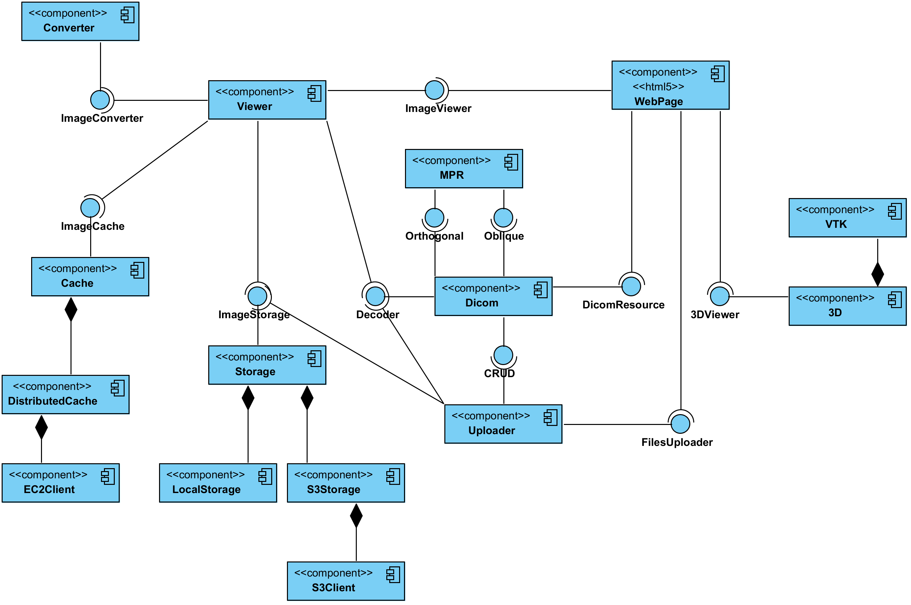

# HTML 5 based Dicom Viewer
This repository contains html5 dicom viewer with JEE back-end, utilization of well known dcm4che library, ready for AWS deployment.

The whole project is divided into two modules:
* mpr, which contains features of orthogonal and oblique/curved Multi Planar Reconstruction,
* dcm-html5, which contains actual web application.

Demo version is available at: [www.dicom-viewer.eu](http://www.dicom-viewer.eu)

## MPR
MPR module is based on work done by [Weasis](https://github.com/nroduit/Weasis) team.
All unnecessary dependencies are removed, so MPR code can be easily executed.

Until now Weasis doesn't directly support oblique or curved mprs, but in this module such feature is provided.
In case of oblique MPR two points express boundaries of reconstruction, which is done between them.   
For reconstruction along curve, set of points with image pixel resolution is required.

Because this module is mostly derivative work of Weasis project, it requires to be published under [Eclipse Public License](http://www.eclipse.org/legal/epl-v10.html).

## DCM-HTML5
This module is written from scratch.
[Apache Software License](http://www.apache.org/licenses/LICENSE-2.0) has been chosen as its licensing model.   

